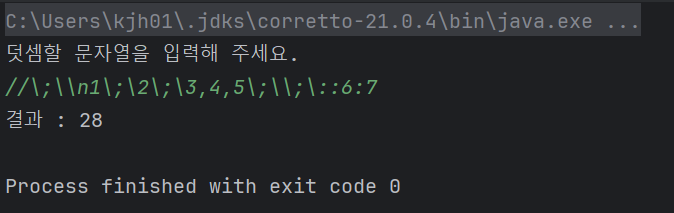

# java-calculator-precourse

## ✅기능 구현 목록

### 1. 덧셈 안내문 출력
   "덧셈할 문자열을 입력해 주세요." 출력하기

### 2. 문자열 입력받기
- 구분자와 양수로 구성된 문자열 입력받기
- 잘못된 값을 입력받은 경우 IllegalArgumentException을 발생시킨다.

1. custom 구분자가 있는 경우
숫자,쉼표,콜론,커스텀 구분자 이외의 값 예외처리
2. custom 구분자가 없는 경우
숫자,쉼표,콜론 이외의 값 예외 처리
쉼표(,) 또는 콜론(:)을 구분자로 가진다.

예: "" => 0, "1,2" => 3, "1,2,3" => 6, "1,2:3" => 6
기본 구분자 외에 커스텀 구분자를 지정할 수 있다.

커스텀 구분자는 문자열 앞부분의 "//"와 "\n" 사이에 위치하는 문자를 커스텀 구분자로 사용
예: "//;\n1;2;3" -> 커스텀 구분자는 세미콜론(;)이다

3. 계산 기능 구현
구분자를 기준으로 입력받은 값에 대해 덧셈을 진행한다. 
4. 결과 출력하기

"결과 : "라는 문구와 함께 결과를 출력한다.