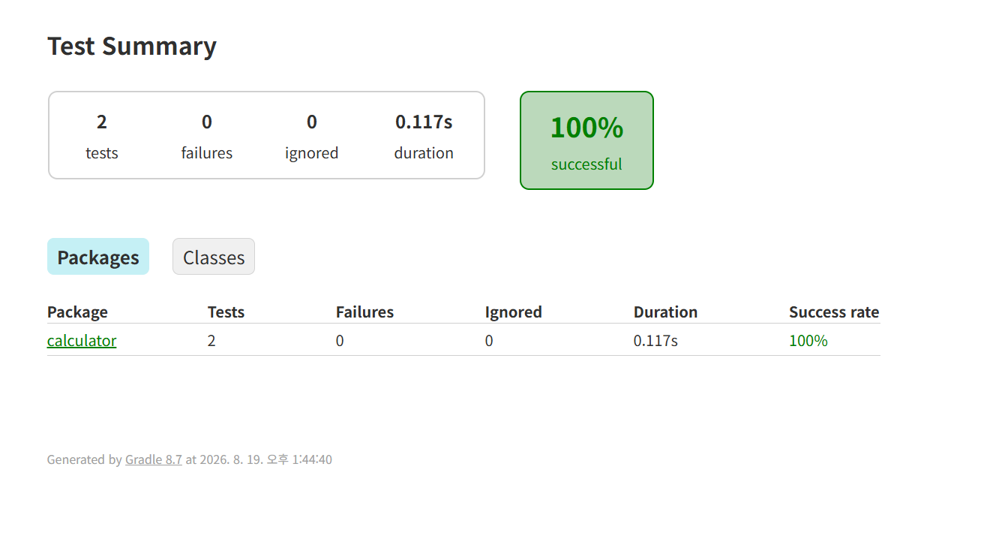

# java-calculator-precourse

## ✅기능 구현 목록

### 1. 덧셈 안내문 출력
   "덧셈할 문자열을 입력해 주세요." 출력하기

### 2. 문자열 입력받기
- 구분자와 양수로 구성된 문자열 입력받기
- 잘못된 값을 입력받은 경우 IllegalArgumentException을 발생시킨다.

1. custom 구분자가 있는 경우 
숫자,쉼표,콜론,커스텀 구분자 이외의 값 예외처리
2. custom 구분자가 없는 경우
숫자,쉼표,콜론 이외의 값 예외 처리
쉼표(,) 또는 콜론(:)을 구분자로 가진다.

예: "" => 0, "1,2" => 3, "1,2,3" => 6, "1,2:3" => 6
기본 구분자 외에 커스텀 구분자를 지정할 수 있다.

커스텀 구분자는 문자열 앞부분의 "//"와 "\n" 사이에 위치하는 문자를 커스텀 구분자로 사용
예: "//;\n1;2;3" -> 커스텀 구분자는 세미콜론(;)이다

3. 계산 기능 구현
구분자를 기준으로 입력받은 값에 대해 덧셈을 진행한다. 
4. 결과 출력하기

"결과 : "라는 문구와 함께 결과를 출력한다.

## 요구사항 분석 및 README 작성 연습

# 문자열 덧셈 계산기

## 기능 목록

### 입력

- [x] 덧셈할 문자의 입력을 안내한다.
- [x] `Console.readLine()` 으로 문자열을 입력받음.

### 계산

- [x] 빈 문자열을 입력하면 `0`을 반환.
- [x] 숫자 하나를 입력하면 해당 숫자를 반환한다.
- [x] 쉼표(,)와 콜론(:)을 기본 구분자로 사용한다.
- [x] 기본 구분자로 분리한 숫자를 더한다.
- [x] `//`와 `\n` 사이에서 커스텀 구분자를 추출한다.
- [x] 커스텀 구분자로 분리한 숫자를 더한다.

### 출력

- [x] 계산 결과를 `결과 : {결과}` 형식으로 출력한다.

### 예외

- [x] 음수가 포함되면 `IllegalArgumentException`을 발생시킨다.
- [x] 숫자와 허용된 구분자 이외의 값이 포함되면 예외가 발생한다.

## 직접 결정한 예외 정책

- [x] 문자열이 구분자로 끝나는 경우
- [x] 커스텀 구분자 선언 형식이 잘못된 경우

## 2026-08-19

## 2026-08-20

### 그래서 이제 뭐하지? 리펙토링이 뭐지? 성능만되면 된건가?
- 목표까지 단계를 나누고 현재 위치 파악 후 향후계획 설정

1단계
요구사항 보고 구현
↓
2단계
테스트 통과             ← 지금 여기까지는 확실히 왔음
↓
3단계
코드를 다시 읽으며 책임/구조 점검
↓
4단계
테스트로 놓친 요구사항 탐색
↓
5단계
리팩터링
↓
6단계
왜 그렇게 바꿨는지 설명